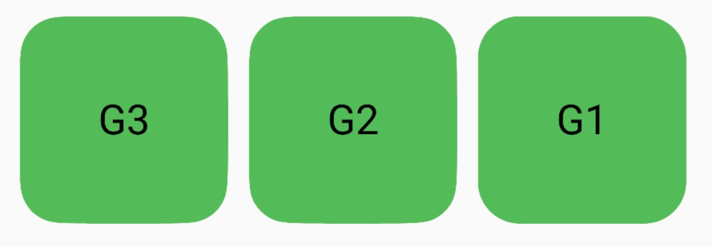
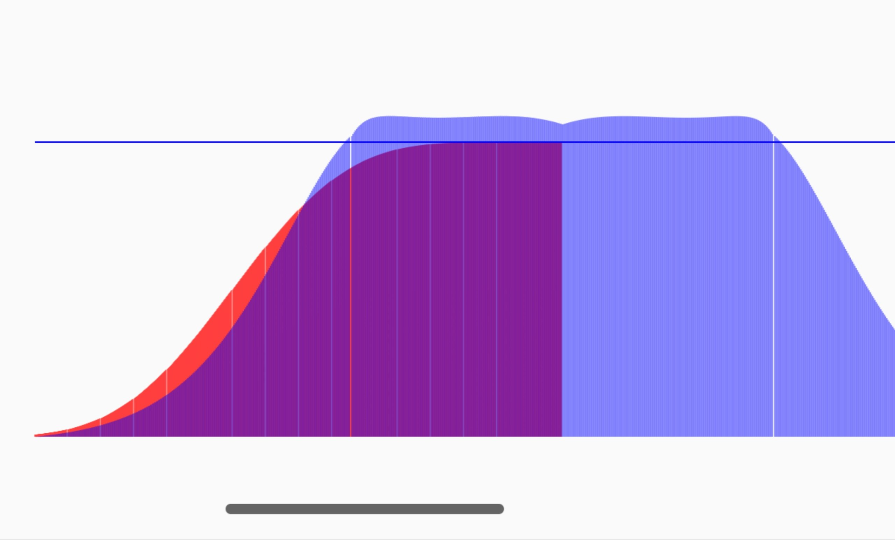
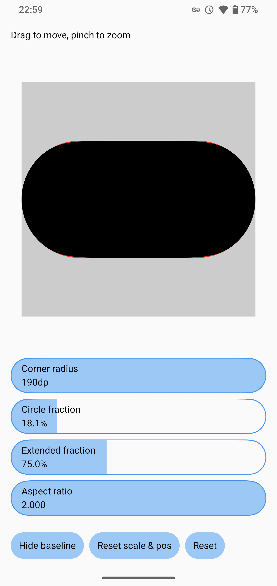
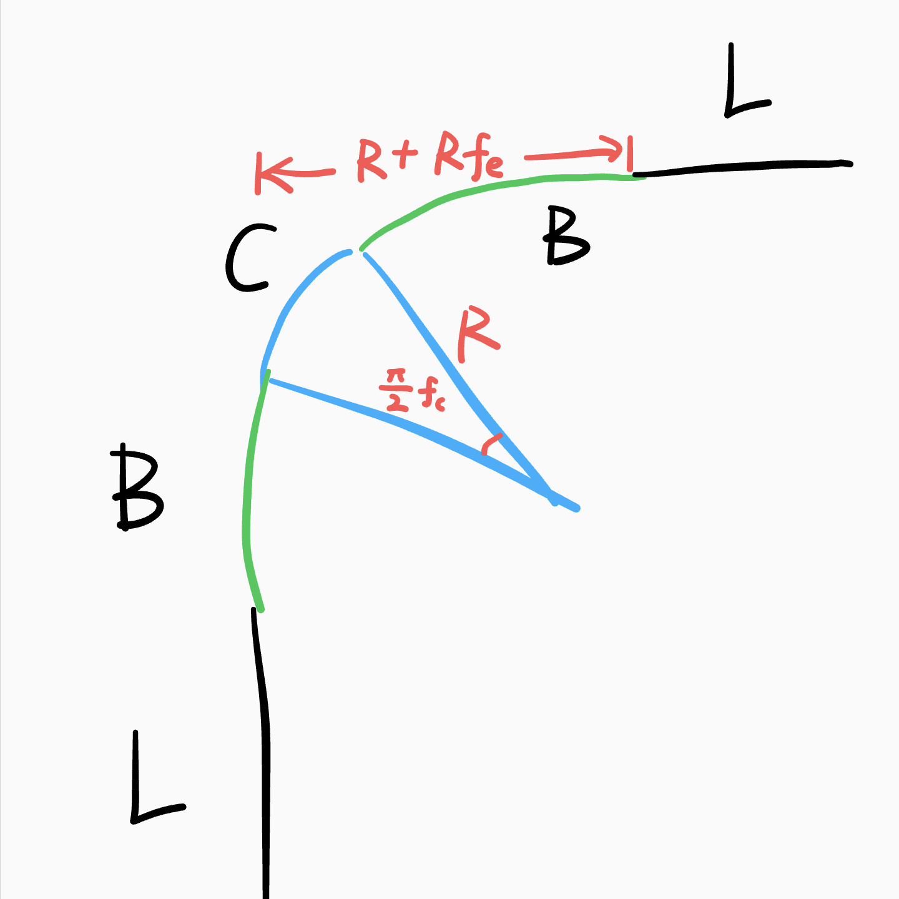

# Capsule

Capsule is a Jetpack Compose library that creates **G3 / G2 continuous** rounded rectangles.



Curvature of G3 continuous rounded corner in Capsule (in purple):



Curvature of G2 continuous rounded corner in Capsule:


## [Playground app](./app/release/app-release.apk)



## Installation

[](https://jitpack.io/#Kyant0/Capsule)

```kotlin
// settings.gradle.kts in root project
dependencyResolutionManagement {
    repositories {
        maven("https://jitpack.io")
    }
}

// build.gradle.kts in module
implementation("com.github.Kyant0:Capsule:<version>")
```

## Usages

Replace the `RoundedCornerShape` with `ContinuousRoundedRectangle` or `ContinuousCapsule`:

```kotlin
// create a basic rounded corner shape
ContinuousRoundedRectangle(16.dp)

// create a capsule shape
ContinuousCapsule
```

Custom continuity:

```kotlin
val g1 = G1Continuity
val g2 = G2Continuity(circleFraction = 0.25f, extendedFraction = 1f)
val g3 = G3Continuity(extendedFraction = 1f)

// create shapes with custom continuity
ContinuousRoundedRectangle(16.dp, continuity = g3)
ContinuousCapsule(continuity = g3)
```

## Performance

Drawing cubic Bézier curves on Android performs poorly. However, the Capsule library uses a very efficient method to
calculate the control points, achieving optimal theoretical performance.

When the shape area is large (almost fullscreen) and the corner radius is constantly changing, performance may decrease.
Use `animatedShape.copy(continuity = G1Continuity)` to temporarily disable corner smoothing during the
animation.

## How it works

Each corner consists of a part of **circle (C)** and two **cubic Bézier curves (B)** that connect the circle to the
straight edges (L) of the rectangle.

The proportion of the circular section is defined by the `circleFraction` (f_c) and the extended length relative to the
corner radius (R) is defined by the `extendedFraction` (f_e) in `CornerSmoothness` class.



It uses mathematical calculations to determine the control points of the cubic Bézier curves to achieve G2 continuity.
