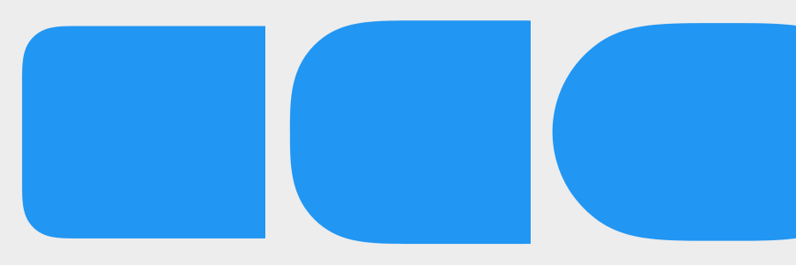
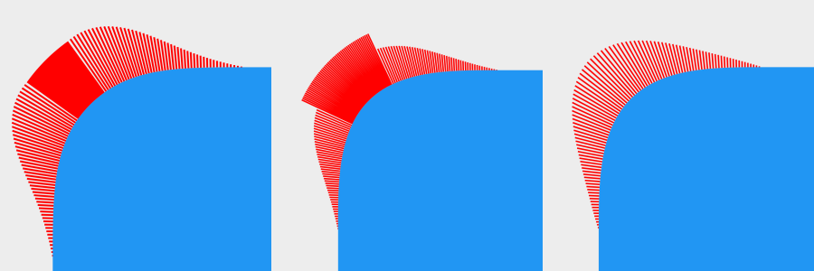
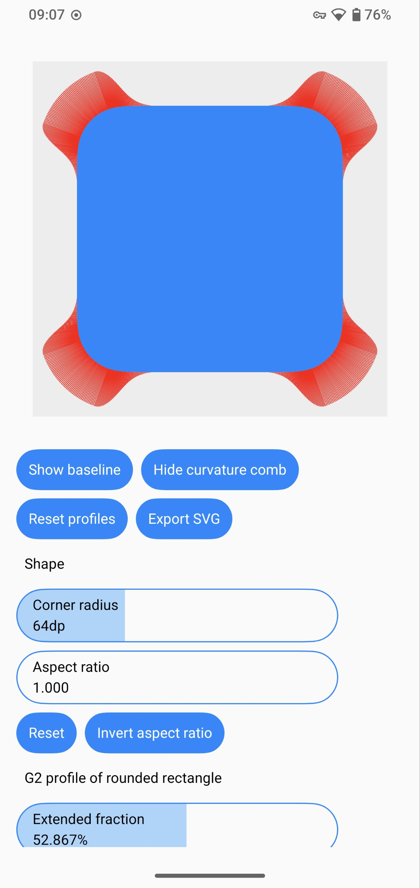

# Capsule

Capsule is a Jetpack Compose library that creates **G2 continuous** rounded rectangles.



Customizable curvature combs:



## [Playground app](./app/release/app-release.apk)



## Installation

[](https://jitpack.io/#Kyant0/Capsule)

```kotlin
// settings.gradle.kts in root project
dependencyResolutionManagement {
    repositories {
        maven("https://jitpack.io")
    }
}

// build.gradle.kts in module
implementation("com.github.Kyant0:Capsule:<version>")
```

## Usages

Replace the `RoundedCornerShape` with `ContinuousRoundedRectangle` or `ContinuousCapsule`:

```kotlin
// create a basic rounded corner shape
ContinuousRoundedRectangle(16.dp)

// create a capsule shape
ContinuousCapsule
```

Custom continuity:

```kotlin
val g1 = G1Continuity
val g2 = G2Continuity(circleFraction = 0.25f, extendedFraction = 1f, /*...*/)

// create shapes with custom continuity
ContinuousRoundedRectangle(16.dp, continuity = g2)
ContinuousCapsule(continuity = g2)
```

## Performance

Drawing cubic Bézier curves on Android performs poorly. However, the Capsule library uses a very efficient method to
calculate the control points, achieving optimal theoretical performance.

When the shape area is large (almost fullscreen) and the corner radius is constantly changing, performance may decrease.
Use `animatedShape.copy(continuity = G1Continuity)` to temporarily disable corner smoothing during the
animation.
