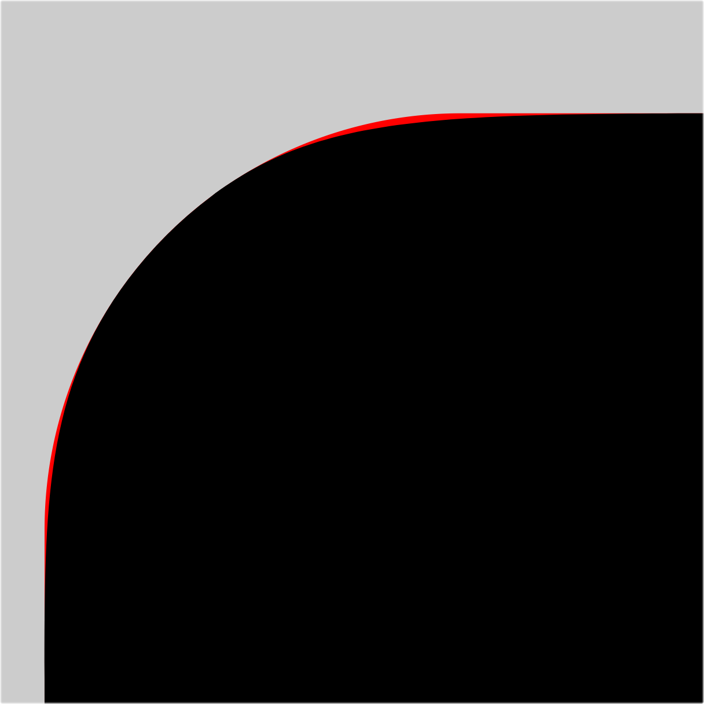
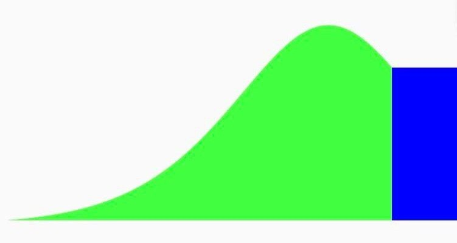
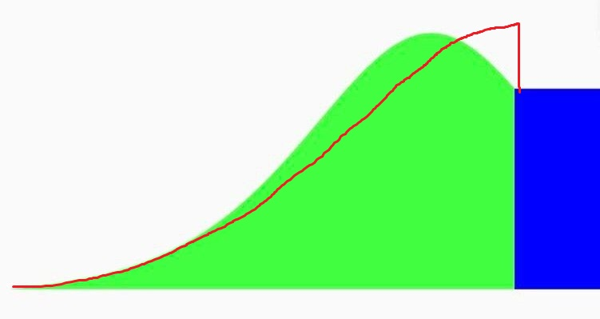
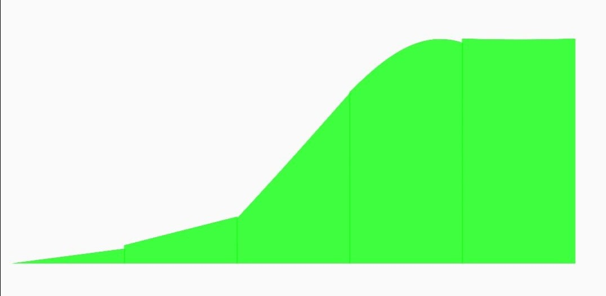

# Capsule

Capsule is a Jetpack Compose library that creates **G2 continuous** rounded corner shapes.



The black one is the G2 continuous corner, the red one is the normal G1 continuous corner.

## [Playground app](./app/release/app-release.apk)


## Installation

[](https://jitpack.io/#Kyant0/Capsule)

```kotlin
// settings.gradle.kts in root project
dependencyResolutionManagement {
    repositories {
        maven("https://jitpack.io")
    }
}

// build.gradle.kts in module
implementation("com.github.Kyant0:Capsule:<version>")
```

## Usages

Replace the `RoundedCornerShape` with `G2RoundedCornerShape` or `CapsuleShape`:

```kotlin
// create a basic rounded corner shape
G2RoundedCornerShape(16.dp)

// create a capsule shape
CapsuleShape

// create a rectangle shape
G2RectangleShape
```

Custom corner smoothness:

```kotlin
// default corner smoothness, which looks similar to the Apple's
val defaultCornerSmoothness = CornerSmoothness.Default

// custom corner smoothness
val cornerSmoothness = CornerSmoothness(
    circleFraction = 0.181f,
    extendedFraction = 0.75f
)

// create shapes with a custom corner smoothness
G2RoundedCornerShape(16.dp, cornerSmoothness = cornerSmoothness)
CapsuleShape(cornerSmoothness = cornerSmoothness)
```

## Performance

The performance of drawing cubic Bézier curves on Android is bad, while the Capsule library uses a very efficient way to
calculate the control points of the cubic Bézier curves, so it does the best theoretically.

When the corner radius is constantly changing, the performance is bad, please use
`animatedShape.copy(cornerSmoothness = CornerSmoothness.None)` to disable corner smoothing in the progress.

## How it works

Each corner consists of a part of **circle (C)** and two **cubic Bézier curves (B)** that connect the circle to the
straight edges (L) of the rectangle.


The amount of circle portion is defined by the `circleFraction` (**f_c**) and the amount of "extended length (R × f_e)"
relative to the corner radius (**R**) is defined by the `extendedFraction` (**f_e**) in `CornerSmoothness` class.

It uses math to calculate the control points of the cubic Bézier curves to meet G2 continuity.

## Comparison with other implementations

| Property        | Capsule                                                | androidx                                                 | Compose       | Apple                                              |
|-----------------|--------------------------------------------------------|----------------------------------------------------------|---------------|----------------------------------------------------|
| Continuity      | G2                                                     | G1 (~G2)                                                 | G1            | ~G3                                                |
| Curvature       | Non-monotonic                                          | Monotonic                                                | Discontinuous | ~Monotonic                                         |
| Curvature graph |  |  | -             |  |
| Graph note      | green: **B**, blue: **C**                              | red: **B**, blue: **C**                                  | -             | last green: **C**                                  |

androidx refers to the `RoundedPolygon.Companion.rectangle` in `androidx.graphics.shapes` package.

The implementation in Figma is similar to the androidx one.
